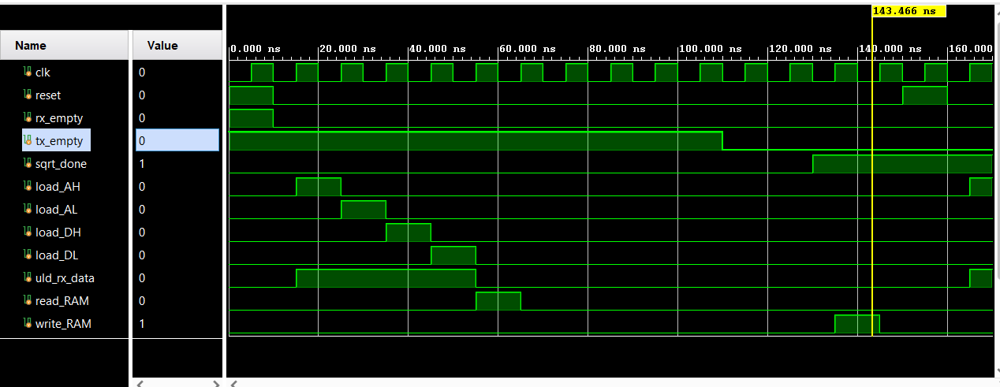
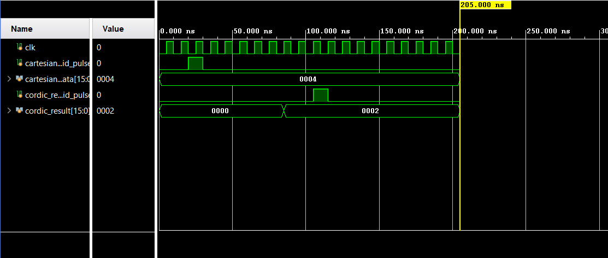
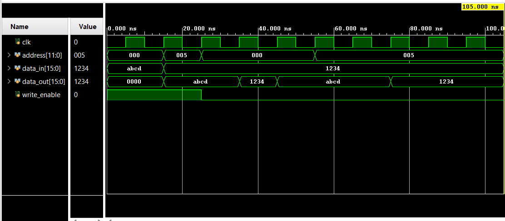
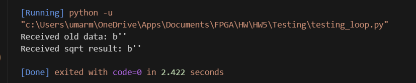
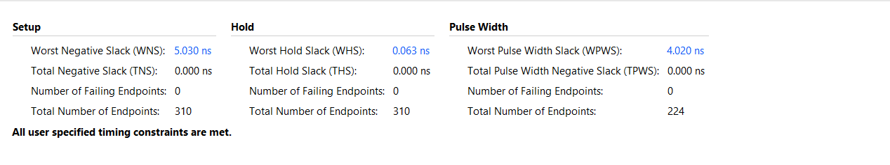
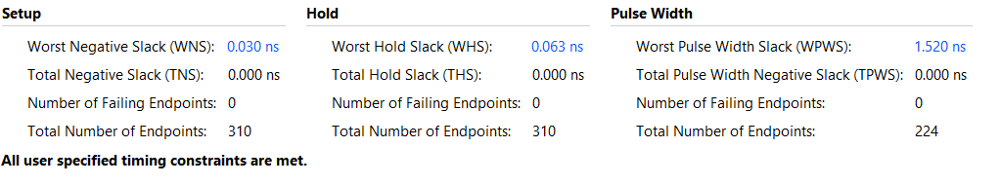

# UART-Based FPGA Controller with FSM, CORDIC, and Block RAM Integration

## Introduction (LoopBack)
A loopback test is a good first step to ensure that a communication system is operating.

### Results: loopback test


### Results: loopback+1 test


### Python Source Code:
```python
import serial

ser = serial.Serial('COM13', 115200, timeout=1)  # Set a timeout of 1 second

ser.write(bytes([0, 2, 4, 6]))

response = ser.read(4) 
print(f"Received: {response}")

# Loopback: The same data echoed back.
# Loopback+1: The data echoed back with 1 added to each byte, e.g., [0x01, 0x03, 0x05].
```

## Module 1: controller_fsm

My source code:

```verilog
`timescale 1ns / 1ps

module controller_fsm (
    input logic clk,
    input logic reset,
    input logic rx_empty,
    input logic tx_empty,
    input logic sqrt_done,
    output logic load_AH,
    output logic load_AL,
    output logic load_DH,
    output logic load_DL,
    output logic uld_rx_data,
    output logic read_RAM,
    output logic write_RAM,
    output logic start_sqrt,
    output logic ld_tx_data,
    output logic send_high_byte_en,
    output logic send_low_byte_en
);

    typedef enum logic [3:0] {
        IDLE,
        LOAD_AH,
        LOAD_AL,
        LOAD_DH,
        LOAD_DL,
        READ_RAM,
        SEND_HIGH,
        SEND_LOW,
        START_SQRT,
        WAIT_SQRT,
        WRITE_RAM
    } state_t;

    state_t state, next_state;

    always_ff @(posedge clk or posedge reset) begin
        if (reset)
            state <= IDLE;
        else
            state <= next_state;
    end

    always_comb begin
        load_AH = 0;
        load_AL = 0;
        load_DH = 0;
        load_DL = 0;
        uld_rx_data = 0;
        read_RAM = 0;
        write_RAM = 0;
        start_sqrt = 0;
        ld_tx_data = 0;
        send_high_byte_en = 0;
        send_low_byte_en = 0;

        next_state = state;

        case (state)
            IDLE: begin
                if (!rx_empty) begin
                    uld_rx_data = 1;
                    load_AH = 1;
                    next_state = LOAD_AL;
                end
            end

            LOAD_AH: begin
                if (!rx_empty) begin
                    uld_rx_data = 1;
                    load_AL = 1;
                    next_state = LOAD_DH;
                end
            end

            LOAD_AL: begin
                if (!rx_empty) begin
                    uld_rx_data = 1;
                    load_DH = 1;
                    next_state = LOAD_DL;
                end
            end

            LOAD_DH: begin
                if (!rx_empty) begin
                    uld_rx_data = 1;
                    load_DL = 1;
                    next_state = READ_RAM;
                end
            end

            LOAD_DL: begin
                next_state = READ_RAM;
            end

            READ_RAM: begin
                read_RAM = 1;
                next_state = SEND_HIGH;
            end

            SEND_HIGH: begin
                if (tx_empty) begin
                    ld_tx_data = 1;
                    send_high_byte_en = 1;
                    next_state = SEND_LOW;
                end
            end

            SEND_LOW: begin
                if (tx_empty) begin
                    ld_tx_data = 1;
                    send_low_byte_en = 1;
                    next_state = START_SQRT;
                end
            end

            START_SQRT: begin
                start_sqrt = 1;
                next_state = WAIT_SQRT;
            end

            WAIT_SQRT: begin
                if (sqrt_done) begin
                    next_state = WRITE_RAM;
                end
            end

            WRITE_RAM: begin
                write_RAM = 1;
                next_state = IDLE;
            end

            default: begin
                next_state = IDLE;
            end
        endcase
    end

endmodule
```

My test bench:

```verilog
module tb_controller_fsm;

    logic clk;
    logic reset;
    logic rx_empty;
    logic tx_empty;
    logic sqrt_done;
    logic load_AH;
    logic load_AL;
    logic load_DH;
    logic load_DL;
    logic uld_rx_data;
    logic read_RAM;
    logic write_RAM;
    logic start_sqrt;
    logic ld_tx_data;
    logic send_high_byte_en;
    logic send_low_byte_en;

    controller_fsm uut (
        .clk(clk),
        .reset(reset),
        .rx_empty(rx_empty),
        .tx_empty(tx_empty),
        .sqrt_done(sqrt_done),
        .load_AH(load_AH),
        .load_AL(load_AL),
        .load_DH(load_DH),
        .load_DL(load_DL),
        .uld_rx_data(uld_rx_data),
        .read_RAM(read_RAM),
        .write_RAM(write_RAM),
        .start_sqrt(start_sqrt),
        .ld_tx_data(ld_tx_data),
        .send_high_byte_en(send_high_byte_en), 
        .send_low_byte_en(send_low_byte_en)
    );

    always begin
        #5 clk = ~clk;
    end

    // Test sequence
    initial begin
        clk = 0;
        reset = 0;
        rx_empty = 1;
        tx_empty = 1;
        sqrt_done = 0;

        reset = 1;
        #10 reset = 0;

        // Test Case 1: Transitions through the states when rx_empty is low
        rx_empty = 0;  // Simulates rx_empty as not empty
        #100;            

        // Test Case 2: Simulates tx_empty being low to progress to SEND_HIGH
        tx_empty = 0;
        #20;            

        // Test Case 3: Simulates sqrt_done to complete the sequence
        sqrt_done = 1;
        #20;            // Allows FSM to transition to WRITE_RAM

        // Test Case 4: Resets again and checks FSM behavior
        reset = 1;
        #10 reset = 0;
        #10; 

        $stop;
    end

    initial begin
        $monitor("Time: %0t | state: %b | load_AH: %b | load_AL: %b | load_DH: %b | load_DL: %b | uld_rx_data: %b | read_RAM: %b | write_RAM: %b | start_sqrt: %b | ld_tx_data: %b", 
                 $time, uut.state, load_AH, load_AL, load_DH, load_DL, uld_rx_data, read_RAM, write_RAM, start_sqrt, ld_tx_data);
    end

endmodule
```

Results:
    


The testbench for the controller_fsm module simulates various input conditions to verify correct state transitions and control signal outputs. A 10ns clock is generated, and the FSM is reset to ensure proper initialization. The test sequence includes setting rx_empty = 0 to simulate data entry, tx_empty = 0 to test transmission, and sqrt_done = 1 to represent operation completion. Another reset is applied later to observe FSM recovery behavior.

## Module 2: cordic_0 

My source code:
Impemented using Cordic Processor (IP Core)

My test bench:

```verilog
module tb_cordic_ip;

    logic clk;
    logic cartesian_valid_pulse;
    logic [15:0] cartesian_data;
    logic cordic_result_valid_pulse;
    logic [15:0] cordic_result;

    cordic_0 uut (
        .aclk(clk),
        .s_axis_cartesian_tvalid(cartesian_valid_pulse),
        .s_axis_cartesian_tdata(cartesian_data),
        .m_axis_dout_tvalid(cordic_result_valid_pulse),
        .m_axis_dout_tdata(cordic_result)
    );

    initial begin
        clk = 0;
        forever #5 clk = ~clk;
    end

    initial begin
        cartesian_valid_pulse = 0;
        cartesian_data = 16'd4; // Input value

        #20 cartesian_valid_pulse = 1;
        #10 cartesian_valid_pulse = 0; // 1-cycle pulse

        wait (cordic_result_valid_pulse);
        $display("CORDIC Result: %d", cordic_result);

        #100 $finish;
    end

endmodule
```

Results:
    


The testbench for the `cordic_0` module verifies the functionality of a CORDIC IP core by providing a valid input and monitoring the output. A 10ns clock is generated using a forever loop. The input `cartesian_data` is set to 16'd4, and a one-cycle `cartesian_valid_pulse` is issued to initiate the computation. The testbench waits for the `cordic_result_valid_pulse` to confirm that the output is ready, then displays the resulting value using `$display`. The simulation ends after a brief delay, ensuring that the CORDIC output is properly captured and validated.

## Module 3: blk_mem_gen_0

My source code:
Implemented using Block RAM generator (IP Core)

My test bench:

```verilog
module tb_ram_ip;

	logic clk;
	logic [11:0] address; 
	logic [15:0] data_in;
	logic [15:0] data_out;
	logic write_enable;

	blk_mem_gen_0 dut (
		.clka(clk),
		.ena(1'b1),          
		.wea(write_enable),  
		.addra(address),     
		.dina(data_in),      
		.douta(data_out)     
	);

	initial begin
		clk = 0;
		forever #5 clk = ~clk;
	end


	initial begin
		address = 12'h000; 
		data_in = 16'hABCD;
		write_enable = 1; 

		$display("At time %0t: Initializing signals. address=%h, data_in=%h, write_enable=%b", $time, address, data_in, write_enable);

		@(posedge clk);
		$display("At time %0t: After first posedge clk. Write 1 attempt.", $time);

		// Data is 16'hABCD, address is 12'h000
		@(posedge clk);
		$display("At time %0t: After second posedge clk. Write 2 attempt.", $time);

		address = 12'h005;
		data_in = 16'h1234;
		$display("At time %0t: Setting address=%h, data_in=%h for Write 2.", $time, address, data_in);


		@(posedge clk);
		$display("At time %0t: After third posedge clk. Turning off write_enable.", $time);

		write_enable = 0;
		$display("At time %0t: write_enable set to %b.", $time, write_enable);


		// Read address 000
		address = 12'h000;
		$display("At time %0t: Setting address=%h for Read 1.", $time, address);

		@(posedge clk); 
		$display("At time %0t: After posedge clk (1st read wait). douta=%h", $time, data_out);

		@(posedge clk);
		$display("At time %0t: After posedge clk (2nd read wait). douta=%h", $time, data_out);

		@(posedge clk);
		$display("At time %0t: After posedge clk (3rd read wait). douta=%h", $time, data_out);

		// Displayd the read data
		$display("At time %0t: Read Data at Address 0x000 = %h", $time, data_out);

		//Read address 005
		address = 12'h005; 
		$display("At time %0t: Setting address=%h for Read 2.", $time, address);

		@(posedge clk); 
		$display("At time %0t: After posedge clk (1st read wait). douta=%h", $time, data_out);

		@(posedge clk); 
		$display("At time %0t: After posedge clk (2nd read wait). douta=%h", $time, data_out);

		@(posedge clk); 
		$display("At time %0t: After posedge clk (3rd read wait). douta=%h", $time, data_out);

		// Displays the read data
		$display("At time %0t: Read Data at Address 0x005 = %h", $time, data_out);

		#20;
		$finish;

	end

endmodule
```

Results:



The testbench for the `blk_mem_gen_0` RAM IP core verifies both write and read operations using a generated 10ns clock. Initially, the test writes `16'hABCD` to address `0x000` and `16'h1234` to address `0x005` by asserting the `write_enable` signal. After writing, `write_enable` is disabled to allow for read operations. The test then reads back from both addresses over multiple clock cycles to account for latency and confirms the output using `$display` statements. This ensures the RAM correctly stores and retrieves data at specified addresses.

## Module 4: top_controller

My source code:

```verilog
`timescale 1ns / 1ps
module top_controller #(
    parameter CLK_DIV_PARAM = 868 // For 100MHz clock and 115200 baud
) (
    input logic clk_100Mhz,  
    input logic reset,       
    input logic rx_in,       
    output logic tx_out      
);


    // Internal Signals

    // FSM signals
    logic rx_empty_fsm;
    logic tx_empty_fsm;
    logic sqrt_done_fsm;
    logic load_AH_fsm;
    logic load_AL_fsm;
    logic load_DH_fsm;
    logic load_DL_fsm;
    logic uld_rx_data_fsm;
    logic read_RAM_fsm;
    logic write_RAM_fsm;
    logic start_sqrt_fsm;
    logic ld_tx_data_fsm;
    logic send_high_byte_en_fsm; 
    logic send_low_byte_en_fsm;  

    // UART signals
    logic [7:0] rx_data_uart;
    logic rx_enable_uart = 1'b1; // enabling receiver always
    logic tx_enable_uart = 1'b1; // enabling transmitter always
    logic [7:0] tx_data_uart;
    logic rx_empty_uart;
    logic tx_empty_uart;

    logic [7:0] addr_high_byte;
    logic [7:0] addr_low_byte;
    logic [7:0] data_high_byte;
    logic [7:0] data_low_byte;
    
    // RAM
    logic [11:0] ram_address_internal; // RAM address is 12 bits
    logic ram_write_enable_internal; 
    logic [15:0] ram_data_in_internal; 
    logic [15:0] ram_data_out_internal;

    // CORDIC signals
    logic [15:0] cordic_input_internal;
    logic cordic_start_pulse_internal; 
    logic [15:0] cordic_output_internal;
    logic cordic_output_valid; 


    // FSM Instance
    controller_fsm fsm_inst (
        .clk(clk_100Mhz),
        .reset(reset),
        .rx_empty(rx_empty_uart), 
        .tx_empty(tx_empty_uart), 
        .sqrt_done(cordic_output_valid), 
        .load_AH(load_AH_fsm),
        .load_AL(load_AL_fsm),
        .load_DH(load_DH_fsm),
        .load_DL(load_DL_fsm),
        .uld_rx_data(uld_rx_data_fsm),
        .read_RAM(read_RAM_fsm),
        .write_RAM(write_RAM_fsm),
        .start_sqrt(start_sqrt_fsm),
        .ld_tx_data(ld_tx_data_fsm),
        .send_high_byte_en(send_high_byte_en_fsm), 
        .send_low_byte_en(send_low_byte_en_fsm)   
    );

    // UART Instance
    uart #(
        .CLK_DIVISION(CLK_DIV_PARAM) 
    ) uart_inst (
        .reset(reset),
        .ld_tx_data(ld_tx_data_fsm), 
        .tx_data(tx_data_uart),      
        .tx_enable(tx_enable_uart),  
        .tx_out(tx_out),             
        .tx_empty(tx_empty_uart),    
        .clk(clk_100Mhz),
        .uld_rx_data(uld_rx_data_fsm), 
        .rx_data(rx_data_uart),      
        .rx_enable(rx_enable_uart),  
        .rx_in(rx_in),               
        .rx_empty(rx_empty_uart)     
    );

    // CORDIC IP core Instance
    cordic_0 cordic_inst (
        .aclk(clk_100Mhz),
        .s_axis_cartesian_tvalid(cordic_start_pulse_internal), 
        .s_axis_cartesian_tdata(cordic_input_internal),       
        .m_axis_dout_tvalid(cordic_output_valid),    
        .m_axis_dout_tdata(cordic_output_internal)            
    );

    // Block Memory Generator (RAM) Instance
    blk_mem_gen_0 ram_inst (
        .clka(clk_100Mhz),
        .ena(1'b1),          
        .wea(ram_write_enable_internal),  
        .addra(ram_address_internal),     
        .dina(ram_data_in_internal),      
        .douta(ram_data_out_internal)     
    );


    always_ff @(posedge clk_100Mhz or posedge reset) begin
        if (reset) begin
            addr_high_byte <= 8'h00;
            addr_low_byte  <= 8'h00;
            data_high_byte <= 8'h00;
            data_low_byte  <= 8'h00;
        end else begin
           
            if (uld_rx_data_fsm) begin
                if (load_AH_fsm) addr_high_byte <= rx_data_uart;
                if (load_AL_fsm) addr_low_byte  <= rx_data_uart;
                if (load_DH_fsm) data_high_byte <= rx_data_uart;
                if (load_DL_fsm) data_low_byte  <= rx_data_uart;
            end
        end
    end
    
    assign ram_address_internal = {addr_high_byte[3:0], addr_low_byte[7:0]};
    // Forgot to ask how the address bytes are structured.
    logic [15:0] assembled_rx_data;
    assign assembled_rx_data = {data_high_byte, data_low_byte};


    // When the FSM is in the WRITE_RAM state, it writes the CORDIC result.
    // Otherwise, the RAM input is the data assembled from the UART bytes.
    assign ram_data_in_internal = write_RAM_fsm ? cordic_output_internal : assembled_rx_data;


    // The data read from RAM is the input to the CORDIC.
    assign cordic_input_internal = ram_data_out_internal;

    // Pulsing CORDIC start based on FSM signal
    logic start_sqrt_fsm_d;
    always_ff @(posedge clk_100Mhz or posedge reset) begin
        if (reset)
            start_sqrt_fsm_d <= 1'b0;
        else
            start_sqrt_fsm_d <= start_sqrt_fsm;
    end
    assign cordic_start_pulse_internal = start_sqrt_fsm && !start_sqrt_fsm_d; // Generates a pulse on the rising edge of start_sqrt_fsm

    // Provides data for UART transmission
    always_comb begin
        tx_data_uart = 8'h00; 
        if (ld_tx_data_fsm) begin 
            if (send_high_byte_en_fsm) begin
                tx_data_uart = ram_data_out_internal[15:8]; // Send the upper byte
            end else if (send_low_byte_en_fsm) begin
                tx_data_uart = ram_data_out_internal[7:0];  // Send the lower byte
            end
        end
    end

    assign ram_write_enable_internal = write_RAM_fsm;


endmodule
```

My test bench:

```verilog
`timescale 1ns / 1ps

module tb_top_controller;

    reg clk_100Mhz;
    reg reset;
    reg rx_in;
    wire tx_out;

    top_controller uut (
        .clk_100Mhz(clk_100Mhz),
        .reset(reset),
        .rx_in(rx_in),
        .tx_out(tx_out)
    );

    always begin
        #5 clk_100Mhz = ~clk_100Mhz;  // 100 MHz clock (10ns period)
    end

    initial begin
        clk_100Mhz = 0;
        reset = 0;
        rx_in = 0;

        reset = 1;
        #20;  
        reset = 0;

        rx_in = 1'b1;  // Start bit
        #8686;
        rx_in = 1'b0;  // Data bit 1 (0xAA pattern)
        #8686;
        rx_in = 1'b1;  // Data bit 2
        #8686;
        rx_in = 1'b0;  // Data bit 3
        #8686;
        rx_in = 1'b1;  // Data bit 4
        #8686;
        rx_in = 1'b0;  // Data bit 5
        #8686;
        rx_in = 1'b1;  // Data bit 6
        #8686;
        rx_in = 1'b0;  // Data bit 7
        #8686;
        rx_in = 1'b1;  // Stop bit
        #8686;

        // UART data processing
        #10000;

        $display("tx_out: %b", tx_out);

        #20000;
        $finish;
    end

    initial begin
        $monitor("At time %t, reset = %b, rx_in = %b, tx_out = %b", $time, reset, rx_in, tx_out);
    end

endmodule
```

Results:


The testbench for the `top_controller` module simulates a UART transmission by applying a sequence of input bits to `rx_in` and observing the output on `tx_out`. The clock is set to 100 MHz. After resetting the module, a start bit (`1'b1`), followed by 8 data bits (alternating `1'b1` and `1'b0`), and a stop bit (`1'b1`) are applied to `rx_in` in a specific pattern. Each bit is held for a duration of 8686ns, representing the bit time at a baud rate of 115200. After the transmission, the output `tx_out` is displayed. The issue is that `tx_out` does not give the square root of the value. To resolve this, the module's FSM or timing synchronization with the clock might be done incorrectly. For the simulation, I used `CLK_DIV_PARAM = 87`.

## Result After Generating Bitstream
- Change: Please change the constraint file to have 10 ns instead of 20 ns for the clock.


```
import serial
import time

ser = serial.Serial('COM13', 115200, timeout=1) 

def send_data(address_high, address_low, data_high, data_low):
    data_to_send = bytes([address_high, address_low, data_high, data_low])
    ser.write(data_to_send) 

    old_data = ser.read(2)
    print(f"Received old data: {old_data}")

    sqrt_result = ser.read(2)
    print(f"Received sqrt result: {sqrt_result}")


send_data(0x01, 0x00, 0x16, 0x00)  

ser.close()
```
The simulation isn’t producing the correct output. I’ve been trying to troubleshoot the issue and suspect it might be related to the `CLK_DIV` parameter. I tested both 868 and 870, but neither resolved the problem.

## Timing Report PART B

### System clock =  100 MHz
- Worst-case Setup Slack: 5.428 ns
- Worst-case Hold Slack: 0.020 ns
- All constraints met with a wide margin.



### System clock =  200 MHz
- Worst-case Setup Slack: 0.030 ns  
- Worst-case Hold Slack: 0.063 ns  
- All constraints still met, but margins are significantly tighter.


### Conclusion
The design is able to meet timing requirements at both 100 MHz and 200 MHz. However, while the 100 MHz configuration offers some timing slack, the 200 MHz configuration only just meets setup and hold requirements. Although functionally valid, this tighter slack suggests the design is close to the performance limit.

## Appendix 


Note that on many linux systems a document converter, pandoc, can be used to render this file as an html file, which can with further effort be converted to other formats including PDF.

```bash
pandoc HW4A.md -o HW4A.html --standalone
```
